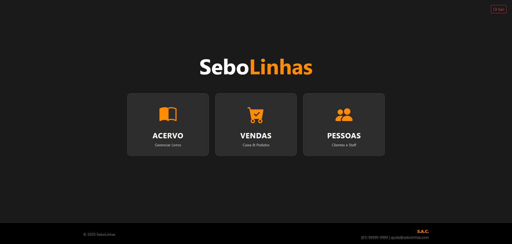

# Sistema de Gerenciamento para Sebos (SeboLinhas)


> Um sistema administrativo web para controle de estoque e vendas de livrarias de livros usados.



## Sobre o Projeto

Este software foi desenvolvido para atender às necessidades de gestão de Sebos. O foco é oferecer uma ferramenta de gerenciamento 
robusta para o administrador, garantindo controle total sobre o negócio sem expor dados ao consumidor final.

### Evolução: De Java para a Web
Este projeto representa uma jornada de adaptação tecnológica:

1. **A Origem (Java & SQL Server):** Projeto nascido no ambiente acadêmico (POO), focado em regras de negócio estritas e arquitetura de software.
2. **A Migração (PHP & MySQL):** Evolução para ambiente Web, mantendo a documentação e regras originais, mas portando o back-end para PHP e modernizando a interface com Bootstrap para maior acessibilidade e responsividade.

---

## Funcionalidades Principais

* **Gerenciamento de Acervo:** Cadastro, edição e controle de estoque de livros.
* **Gestão de Clientes:** Base de dados para histórico e fidelização.
* **Registro de vendas:** Registro de saídas e vendas de forma ágil.
* **Painel Administrativo:** Visão geral do negócio (exclusivo para gestores).

---

## Tecnologias Utilizadas

* **Back-end:** PHP
* **Banco de Dados:** MySQL
* **Front-end:** HTML5, CSS3, Bootstrap 5
* **Ambiente de Desenvolvimento:** XAMPP

---

## Instalação e Configuração

### Pré-requisitos
* XAMPP.
* Git.

### Passo a Passo

1. **Clone o repositório**
   Abra o terminal na pasta `htdocs` do seu servidor local:
   ```bash
   git clone https://github.com/Joao-Victor-Sena/sistema-sebo.git
2.  **Configuração do Banco de Dados**
    * Abra o **PHPMyAdmin** (ou seu gerenciador preferido).
    * Crie um banco de dados com o nome: `integrador`.
    * Importe o arquivo `.sql` localizado na pasta `database/` deste projeto.

3.  **Verificação de Credenciais**
    * Abra o arquivo de conexão (`conexao.php`).
    * Certifique-se de que o usuário e senha batem com o seu ambiente 
    (Teste Gerente: user `00000000000`, senha `admin`/ 
    Teste Vendedor: `11111111111` , senha `1234`).

4.  **Executar**
    * Inicie o **Apache** e o **MySQL** no XAMPP.
    * Acesse no navegador: `http://localhost/sistema-sebo`

---

## Autores

* **João Victor Sena**
* **Micael Vasconcelos**
* **Pedro Henrique Moreira**
* **Tiago Kauã**

---
*Desenvolvido como projeto acadêmico de evolução de software e sistema para web.*